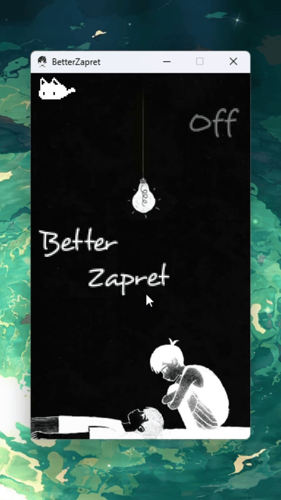
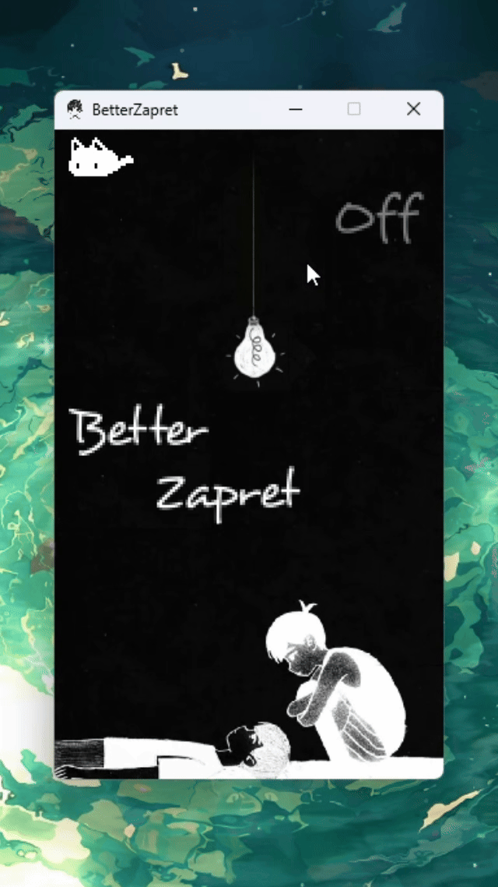
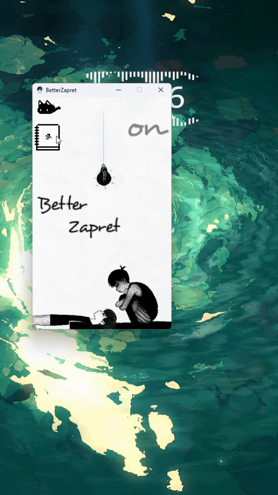

# BetterZapret
  

Эта программа не является самим **zapret-discord-youtube**, а всего лишь дополнением к нему (графической оболочкой)
>[!WARNING]
>Антивирусы могут помечать exe-файл из релиза как вредоносный - **это ложное срабатывание**. Происходит это из-за отсутствия какой-либо цифровой подписи, так как я компилирую проект через *auto-py-to-exe*. Вы можете сами сделать билд проекта, скачав исходный код

## Остерегайтесь мошенников
Перед скачиванием или запуском bat-файла запрета, убедитесь, что скачали из официального репозитория [Flowseal](https://github.com/Flowseal/zapret-discord-youtube). Скачивая из других источников (ТГ-каналов, сайтов и т.п.), вы рискуете **своей безопасностью**

## Используемые библиотеки
В этом проекте я использую исключительно встроенные библиотеки Python на Windows
```python
from tkinter import *
from tkinter import ttk
from tkinter import font
from pathlib import Path
from tkinter.scrolledtext import ScrolledText
import tkinter.messagebox
import tkinter.filedialog
import os
import subprocess
import ctypes
import sys
import json
```

## Руководство по использованию
1. Для начала скачайте exe-файл из релиза данного проекта или сделайте билд сами
2. Затем скачайте оригинальный запрет от [Flowseal](https://github.com/Flowseal/zapret-discord-youtube)
   
>[!NOTE]
>Оригинальный запрет был разработан пользователем [bol-van](https://github.com/bol-van/zapret/tree/master). Flowseal же сделал форк

3. Откройте exe-файл от имени администратора, затем выберите нужный bat-файл, нажав на иконку кота в левом верхнем углу
   
   

4. Чтобы включить/отключить запрет нажмите на лампочку
   
   
>[!IMPORTANT]
>Во время **включения/отключения** может появиться **командная строка**, не пугайтесь - это **нормально**, подробнее смотрите [здесь](#включениеотключение)
   
5. Вы можете просматривать, изменять и добавлять домены: для этого кликните на иконку блокнота, затем в новом окне укажите путь к **list-general.txt**. После этих действий внизу появится список текущих доменов. Нажмите на кнопку **Сохранить**, чтобы применить к ним изменения
   
   


## Принцип работы программы
### Старт
  Сначала программа проверяет, запущена ли она от имени администратора
  ```python
  if isadmin() == False:
    tkinter.messagebox.showerror(message="Программа запущена не от имени администратора")
    sys.exit(1) # Закрытие программы
  ```
  Затем проверяется, запущен ли уже запрет
  ```python
ZapretRun = subprocess.run("sc qc windivert", shell=True)
if ZapretRun.returncode == 0:
    ZaonBg() # Смена фона и деталей интерфейса
  ```
  ### Добавление bat-файла
  Когда вы добавляете путь к bat-файлу, выполняется метод [PathCreate](BetterZapret.py#L159-181)
  ### Включение/Отключение
  Во время включения выполняется запрос в командную строку, поэтому она может появиться на секунду
  ```python
  def Zaon():
      try: # Пытаемся открыть файл
          os.startfile(path) # Запуск bat-файла
          ZaonBg() # Смена фона и деталей интерфейса
      except: # Если не получается, то выводим ошибку
          tkinter.messagebox.showwarning(message="Ошибка при открытии bat-файла")
  ```
   Во время отключения также выполняется запрос в командную строку, поэтому она может появиться на секунду
   ```python
   def Zaoff():
    ZaoffBg() # Смена фона и деталей интерфейса
    os.system("taskkill /im winws.exe") # Выключение запрета
    os.system("sc stop windivert") # Отключение WinDivert
   ```
   ### Поиск list-general
   За автоматический поиск отвечает функция [AutoPathList](BetterZapret.py#L207-225)

   Функция поиска вручную работает аналогично [PathCreate](BetterZapret.py#L159-181)
   ## Доп. информация
   >[!NOTE]
   >Все изображения и спрайты взяты из игры OMORI, созданной OMOCAT

   >[!TIP]
   >Для удобства пользования вы можете создать ярлык exe-файла, после в свойствах ярлыка поставить галочку на *запуск от имени администратора*
